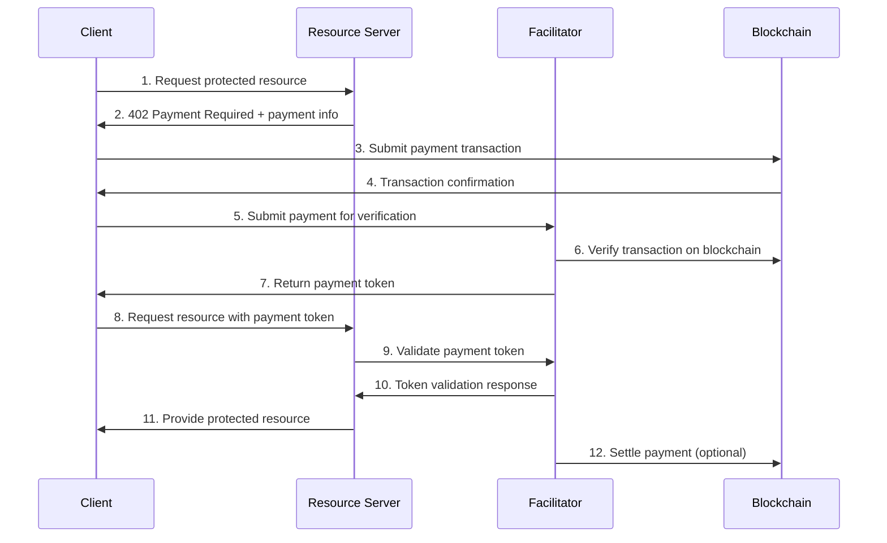

# X402 Facilitator Demo Project

A comprehensive demonstration of the **facilitator's role** in the X402 payment protocol. This project showcases how facilitators manage payment verification, settlement, and coordination between clients and resource servers.

## Overview

The X402 protocol enables micropayments for API access, with facilitators playing a crucial role in:
- **Payment Verification**: Validating blockchain transactions
- **Settlement Management**: Coordinating payment distribution
- **Trust Mediation**: Acting as intermediaries between parties
- **Resource Coordination**: Managing access to protected resources

## Project Structure

```
facilitator-demo/
├── facilitator-server/     # Core facilitator implementation
│   ├── facilitator.js      # Main facilitator server
│   └── package.json        # Dependencies
├── resource-server/        # Protected resource provider
│   ├── resource-server.js  # Resource server with X402 integration
│   └── package.json        # Dependencies
├── client-example/         # Client implementation
│   ├── client.js           # X402 client example
│   └── package.json        # Dependencies
├── scripts/                # Demo and utility scripts
│   ├── start-all.js        # Start all services
│   ├── demo.js             # Complete workflow demo
│   ├── setup.js            # Dependency installation
│   └── package.json        # Script dependencies
└── docs/                   # Comprehensive documentation
    ├── README.md           # Main documentation
    ├── FACILITATOR_API.md  # API reference
    └── WORKFLOW.md         # Detailed workflow
```

## Quick Start

### 1. Setup Dependencies

```bash
# Install all dependencies
node scripts/setup.js

# Or install manually for each component
cd facilitator-server && npm install
cd ../resource-server && npm install
cd ../client-example && npm install
cd ../scripts && npm install
```

### 2. Start All Services

```bash
# Start facilitator and resource servers
node scripts/start-all.js

# Or with automatic dependency installation
node scripts/start-all.js --install

# Or start services and run demo
node scripts/start-all.js --demo
```

### 3. Run the Demo

```bash
# Run automated demo
node scripts/demo.js

# Or run interactive demo
node scripts/demo.js --interactive
```

## Services

### Facilitator Server (Port 3003)

The core facilitator service that handles:
- Payment verification (`POST /verify`)
- Payment settlement (`POST /settle`)
- Health monitoring (`GET /health`)

**Key Features:**
- Blockchain transaction verification
- Payment token generation
- Settlement coordination
- Security validation

### Resource Server (Port 3004)

A sample resource provider that:
- Protects resources with X402 payments
- Integrates with the facilitator
- Provides various API endpoints
- Demonstrates payment-gated access

**Available Resources:**
- `/api/catalog` - Free resource catalog
- `/api/data/basic` - Basic data (0.001 ETH)
- `/api/data/premium` - Premium data (0.005 ETH)
- `/api/analytics` - Analytics data (0.01 ETH)

### Client Example

Demonstrates how to:
- Discover available resources
- Handle 402 Payment Required responses
- Create and submit payment payloads
- Access protected resources

## X402 Facilitator Workflow



## Key Components

### 1. Payment Verification

The facilitator verifies blockchain transactions by:
- Validating transaction hashes
- Checking payment amounts
- Verifying sender/receiver addresses
- Ensuring transaction confirmations

### 2. Token Management

Secure payment tokens that:
- Prove payment verification
- Include expiration times
- Contain resource access permissions
- Enable stateless validation

### 3. Settlement Coordination

Manages payment distribution:
- Tracks payment states
- Coordinates multi-party settlements
- Handles dispute resolution
- Provides audit trails

## API Examples

### Verify Payment

```bash
curl -X POST http://localhost:3003/verify \
  -H "Content-Type: application/json" \
  -d '{
    "payment": {
      "paymentId": "uuid-here",
      "amount": "0.005",
      "currency": "ETH",
      "txHash": "0x...",
      "from": "0x...",
      "to": "0x..."
    },
    "resource": "/api/data/premium",
    "clientId": "client-001"
  }'
```

### Access Protected Resource

```bash
curl -X GET http://localhost:3004/api/data/premium \
  -H "X-Payment-Token: eyJhbGciOiJIUzI1NiIs..."
```

## Documentation

- **[Main Documentation](./docs/README.md)** - Comprehensive guide
- **[API Reference](./docs/FACILITATOR_API.md)** - Detailed API docs
- **[Workflow Guide](./docs/WORKFLOW.md)** - Step-by-step process

## Development

### Running Individual Services

```bash
# Start facilitator only
cd facilitator-server && npm start

# Start resource server only
cd resource-server && npm start

# Run client example only
cd client-example && npm start
```

### Customization

1. **Add New Resources**: Modify `resource-server/resource-server.js`
2. **Custom Payment Logic**: Update `facilitator-server/facilitator.js`
3. **Client Behavior**: Customize `client-example/client.js`
4. **Demo Scenarios**: Extend `scripts/demo.js`

### Testing

```bash
# Test facilitator endpoints
curl http://localhost:3003/health

# Test resource catalog
curl http://localhost:3004/api/catalog

# Run full demo
node scripts/demo.js
```

## Configuration

Key configuration options:

- **Ports**: Facilitator (3003), Resource Server (3004)
- **Payment Tokens**: JWT-based with configurable expiration
- **Blockchain**: Mock implementation (easily replaceable)
- **Security**: CORS enabled, input validation

## Security Considerations

- Payment verification uses cryptographic validation
- Tokens include expiration and scope limitations
- Input sanitization and validation
- Secure communication between services
- Audit logging for all transactions

## Troubleshooting

### Services Won't Start

```bash
# Check if ports are available
netstat -an | findstr :3003
netstat -an | findstr :3004

# Install dependencies
node scripts/setup.js

# Check Node.js version (requires 14+)
node --version
```

### Demo Fails

```bash
# Ensure services are running
curl http://localhost:3003/health
curl http://localhost:3004/health

# Check service logs
node scripts/start-all.js
```

### Payment Verification Issues

- Verify mock transaction data format
- Check payment amounts and currency
- Ensure proper JSON structure
- Validate client ID format

## References

- **[X402 Protocol Documentation](https://x402.gitbook.io/x402)**
- **[Facilitator Concepts](https://x402.gitbook.io/x402/core-concepts/facilitator)**
- **[Payment Flow Specification](https://x402.gitbook.io/x402/core-concepts/payment-flow)**

## Contributing

1. Fork the repository
2. Create a feature branch
3. Make your changes
4. Add tests and documentation
5. Submit a pull request

## License

MIT License - see LICENSE file for details.

---

**Ready to explore X402 facilitators?** Start with `node scripts/setup.js` and then `node scripts/start-all.js --demo`!