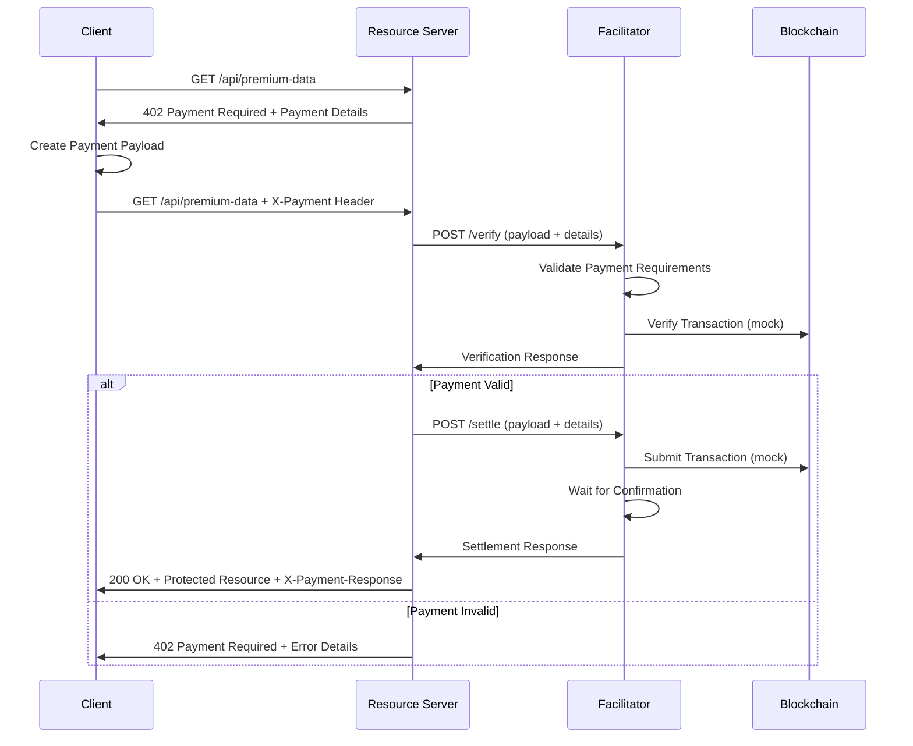

# X402 Facilitator Demo Project

This project demonstrates the role and implementation of a **facilitator** in the X402 payment protocol. The facilitator is a crucial component that simplifies payment verification and settlement for resource servers without requiring them to maintain direct blockchain connectivity.

## What is a Facilitator?

A facilitator in the X402 protocol is an optional but recommended service that:

- **Verifies payment payloads** submitted by clients
- **Settles payments** on the blockchain on behalf of servers
- **Reduces operational complexity** for resource servers
- **Ensures protocol consistency** across different services

The facilitator acts as an independent verification and settlement layer, helping servers confirm payments and submit transactions onchain without requiring direct blockchain infrastructure.

## Project Structure

```
facilitator-demo/
├── facilitator-server/     # The facilitator implementation
│   ├── facilitator.js      # Main facilitator server with /verify and /settle endpoints
│   └── package.json        # Dependencies for facilitator
├── resource-server/        # Example resource server using the facilitator
│   ├── resource-server.js  # Server with payment-gated API endpoints
│   └── package.json        # Dependencies for resource server
├── client-example/         # Client that interacts with payment-gated resources
│   ├── client.js           # Demo client with X402 payment flow
│   └── package.json        # Dependencies for client
├── docs/                   # Documentation
│   ├── README.md           # This file
│   ├── FACILITATOR_API.md  # Facilitator API documentation
│   └── WORKFLOW.md         # Complete workflow explanation
└── scripts/                # Demo and utility scripts
    ├── start-all.js        # Start all services
    ├── demo.js             # Run complete demo
    └── test-endpoints.js   # Test individual endpoints
```

## Key Components

### 1. Facilitator Server (`facilitator-server/`)

The facilitator server implements the core X402 facilitator functionality:

- **`POST /verify`** - Verifies payment payloads against payment requirements
- **`POST /settle`** - Settles verified payments on the blockchain
- **`GET /health`** - Health check endpoint

**Key Features:**
- Mock blockchain verification for demonstration
- Comprehensive error handling
- Payment validation against requirements
- Transaction settlement simulation

### 2. Resource Server (`resource-server/`)

Demonstrates how a resource server integrates with a facilitator:

- **Payment-gated API endpoints** requiring X402 payments
- **Automatic facilitator integration** for verification and settlement
- **402 Payment Required responses** with payment details
- **Protected resources** with valuable content

**Protected Endpoints:**
- `/api/premium-data` - Premium market data feed
- `/api/ai-analysis` - AI-powered market analysis
- `/api/exclusive-report` - Exclusive research report

### 3. Client Example (`client-example/`)

Shows how clients interact with X402 payment-gated resources:

- **Automatic payment flow** handling
- **Payment payload creation** and submission
- **Resource discovery** through catalog endpoints
- **Complete workflow demonstration**

## The X402 Facilitator Workflow



## Benefits of Using a Facilitator

### For Resource Servers:
- **No blockchain infrastructure required** - The facilitator handles all blockchain interactions
- **Simplified integration** - Just HTTP calls to `/verify` and `/settle` endpoints
- **Consistent behavior** - Standardized verification and settlement flows
- **Reduced complexity** - Focus on business logic instead of payment processing

### For the Ecosystem:
- **Protocol consistency** - Ensures correct X402 implementation across services
- **Faster adoption** - Lower barrier to entry for new services
- **Reliability** - Centralized expertise in payment processing
- **Scalability** - Shared infrastructure for multiple resource servers

## Getting Started

### Prerequisites
- Node.js 16+ installed
- npm or yarn package manager

### Installation

1. **Install dependencies for all components:**
   ```bash
   # Install facilitator dependencies
   cd facilitator-server
   npm install
   cd ..
   
   # Install resource server dependencies
   cd resource-server
   npm install
   cd ..
   
   # Install client dependencies
   cd client-example
   npm install
   cd ..
   ```

2. **Start the services:**
   ```bash
   # Terminal 1: Start facilitator (port 3003)
   cd facilitator-server
   npm start
   
   # Terminal 2: Start resource server (port 3004)
   cd resource-server
   npm start
   
   # Terminal 3: Run client demo
   cd client-example
   npm start
   ```

### Quick Demo

1. **Discover available resources:**
   ```bash
   cd client-example
   npm run discover
   ```

2. **Test individual endpoints:**
   ```bash
   npm run test-premium    # Test premium data endpoint
   npm run test-ai         # Test AI analysis endpoint
   npm run test-report     # Test exclusive report endpoint
   ```

3. **Run complete workflow:**
   ```bash
   npm start  # Runs full demonstration
   ```

## Understanding the Code

### Facilitator Implementation

The facilitator server (`facilitator-server/facilitator.js`) implements:

```javascript
// Verify payment payload
app.post('/verify', async (req, res) => {
  const { paymentPayload, paymentDetails } = req.body;
  
  // Validate payment requirements
  // Perform blockchain verification
  // Return verification result
});

// Settle payment on blockchain
app.post('/settle', async (req, res) => {
  const { paymentPayload, paymentDetails } = req.body;
  
  // Re-verify payment
  // Submit to blockchain
  // Wait for confirmation
  // Return settlement result
});
```

### Resource Server Integration

The resource server (`resource-server/resource-server.js`) uses the facilitator:

```javascript
// Payment verification middleware
const requirePayment = async (req, res, next) => {
  const paymentHeader = req.headers['x-payment'];
  
  if (!paymentHeader) {
    return res.status(402).json({ /* Payment Required */ });
  }
  
  // Verify with facilitator
  const verification = await axios.post(`${FACILITATOR_URL}/verify`, {
    paymentPayload,
    paymentDetails
  });
  
  if (verification.data.valid) {
    // Settle with facilitator
    const settlement = await axios.post(`${FACILITATOR_URL}/settle`, {
      paymentPayload,
      paymentDetails
    });
    
    if (settlement.data.success) {
      next(); // Serve protected resource
    }
  }
};
```

### Client Payment Flow

The client (`client-example/client.js`) handles the payment flow:

```javascript
// Access protected resource
async accessResource(endpoint) {
  // Try without payment first
  let response = await axios.get(endpoint);
  
  if (response.status === 402) {
    // Create payment payload
    const paymentPayload = this.createPaymentPayload(response.data.accepts[0]);
    
    // Retry with payment
    response = await axios.get(endpoint, {
      headers: {
        'X-Payment': Buffer.from(JSON.stringify(paymentPayload)).toString('base64')
      }
    });
  }
  
  return response.data;
}
```

## Next Steps

1. **Explore the code** - Each component is well-documented with inline comments
2. **Modify payment amounts** - Change `PAYMENT_CONFIG` in the resource server
3. **Add new protected resources** - Extend `PROTECTED_RESOURCES` object
4. **Implement real blockchain** - Replace mock verification with actual blockchain calls
5. **Add authentication** - Implement wallet signature verification

## References

- [X402 Protocol Documentation](https://x402.gitbook.io/x402)
- [Facilitator Concept](https://x402.gitbook.io/x402/core-concepts/facilitator)
- [HTTP 402 Payment Required](https://x402.gitbook.io/x402/core-concepts/http-402)

## License

Apache-2.0 - See the main project license for details.