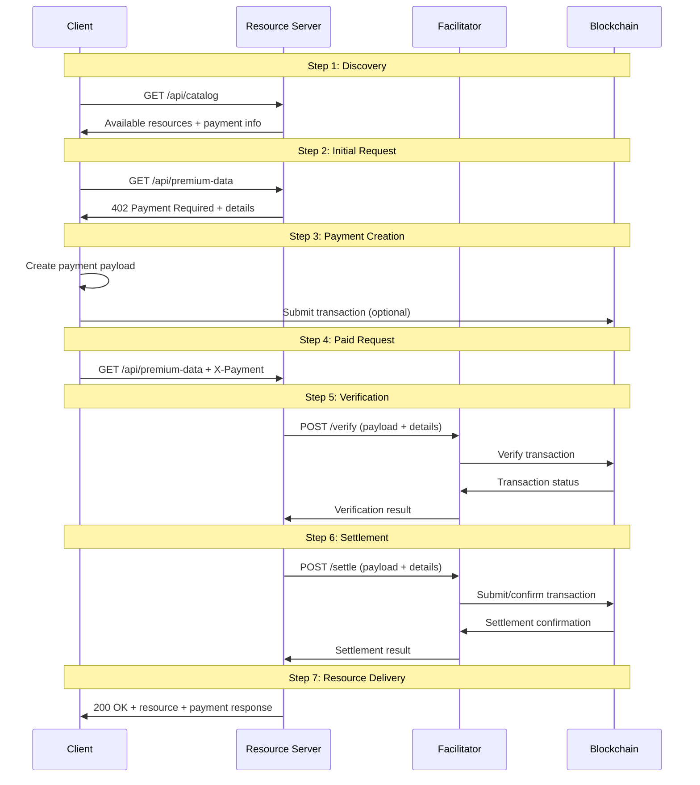
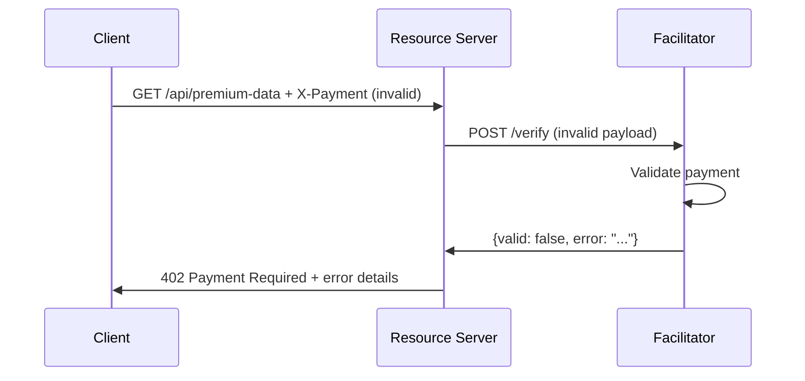

# X402 Facilitator Workflow Documentation

This document provides a comprehensive explanation of the X402 facilitator workflow, detailing each step in the payment process and the interactions between clients, resource servers, and facilitators.

## Overview

The X402 protocol enables HTTP-based micropayments for API access. The facilitator plays a crucial role by handling payment verification and blockchain settlement, allowing resource servers to focus on their core functionality without managing blockchain infrastructure.

## Workflow Participants

### 1. Client (Buyer)
- **Role:** Requests access to paid resources
- **Responsibilities:** 
  - Discover payment requirements
  - Create and submit payment payloads
  - Handle payment responses

### 2. Resource Server (Seller)
- **Role:** Provides paid API endpoints and content
- **Responsibilities:**
  - Define payment requirements
  - Validate payments via facilitator
  - Serve protected resources after payment

### 3. Facilitator
- **Role:** Payment verification and settlement service
- **Responsibilities:**
  - Verify payment payloads against requirements
  - Settle payments on blockchain
  - Provide standardized payment processing

### 4. Blockchain Network
- **Role:** Immutable payment ledger
- **Responsibilities:**
  - Record payment transactions
  - Provide transaction confirmation
  - Ensure payment finality

## Complete Workflow Steps

### Step 1: Resource Discovery

**Client discovers available paid resources**

```http
GET /api/catalog HTTP/1.1
Host: resource-server.example.com
```

**Response:**
```json
{
  "service": "X402 Resource Server",
  "available_resources": [
    {
      "endpoint": "/api/premium-data",
      "description": "Premium market data feed",
      "payment_required": {
        "amount": "1000000",
        "token": "0xA0b86a33E6441b8dB4B2f8b8C4b4b4b4b4b4b4b4",
        "scheme": "transferWithAuthorization",
        "networkId": "8453"
      }
    }
  ]
}
```

**What happens:**
- Client learns about available paid endpoints
- Payment requirements are disclosed upfront
- No payment needed for discovery

---

### Step 2: Initial Resource Request

**Client attempts to access protected resource without payment**

```http
GET /api/premium-data HTTP/1.1
Host: resource-server.example.com
```

**Response:**
```http
HTTP/1.1 402 Payment Required
Content-Type: application/json

{
  "error": "Payment Required",
  "message": "This resource requires payment to access",
  "accepts": [
    {
      "scheme": "transferWithAuthorization",
      "amount": "1000000",
      "token": "0xA0b86a33E6441b8dB4B2f8b8C4b4b4b4b4b4b4b4",
      "recipient": "0x742d35Cc6634C0532925a3b8D4b4b4b4b4b4b4b4",
      "networkId": "8453",
      "description": "Payment required for /api/premium-data"
    }
  ]
}
```

**What happens:**
- Resource server detects missing payment
- Returns HTTP 402 with payment requirements
- Client learns exact payment details needed

---

### Step 3: Payment Payload Creation

**Client creates payment payload based on requirements**

```javascript
// Client-side payment payload creation
const paymentPayload = {
  scheme: "transferWithAuthorization",
  networkId: "8453",
  amount: "1000000",
  token: "0xA0b86a33E6441b8dB4B2f8b8C4b4b4b4b4b4b4b4",
  recipient: "0x742d35Cc6634C0532925a3b8D4b4b4b4b4b4b4b4",
  sender: "0x1234567890123456789012345678901234567890",
  transactionHash: "0xabc123def456789012345678901234567890abcdef123456789012345678901234",
  nonce: Date.now(),
  timestamp: new Date().toISOString()
};

// Encode as base64 for HTTP header
const paymentHeader = Buffer.from(JSON.stringify(paymentPayload)).toString('base64');
```

**What happens:**
- Client prepares blockchain transaction (or uses existing one)
- Payment payload includes all required fields
- Payload is encoded for HTTP transmission

---

### Step 4: Resource Request with Payment

**Client retries request with payment header**

```http
GET /api/premium-data HTTP/1.1
Host: resource-server.example.com
X-Payment: eyJzY2hlbWUiOiJ0cmFuc2ZlcldpdGhBdXRob3JpemF0aW9uIi...
```

**What happens:**
- Client includes X-Payment header with encoded payload
- Resource server receives payment for verification
- Payment processing begins

---

### Step 5: Payment Verification

**Resource server verifies payment with facilitator**

```http
POST /verify HTTP/1.1
Host: facilitator.example.com
Content-Type: application/json

{
  "paymentPayload": {
    "scheme": "transferWithAuthorization",
    "networkId": "8453",
    "amount": "1000000",
    "token": "0xA0b86a33E6441b8dB4B2f8b8C4b4b4b4b4b4b4b4",
    "recipient": "0x742d35Cc6634C0532925a3b8D4b4b4b4b4b4b4b4",
    "sender": "0x1234567890123456789012345678901234567890",
    "transactionHash": "0xabc123...",
    "nonce": 1698765432000,
    "timestamp": "2024-10-24T20:30:32.000Z"
  },
  "paymentDetails": {
    "scheme": "transferWithAuthorization",
    "networkId": "8453",
    "amount": "1000000",
    "token": "0xA0b86a33E6441b8dB4B2f8b8C4b4b4b4b4b4b4b4",
    "recipient": "0x742d35Cc6634C0532925a3b8D4b4b4b4b4b4b4b4"
  }
}
```

**Facilitator verification process:**

1. **Field Validation:**
   ```javascript
   // Check required fields
   if (!paymentPayload.scheme || !paymentPayload.amount) {
     return { valid: false, error: 'Missing required fields' };
   }
   ```

2. **Requirement Matching:**
   ```javascript
   // Verify amount matches
   if (paymentPayload.amount !== paymentDetails.amount) {
     return { valid: false, error: 'Amount mismatch' };
   }
   ```

3. **Blockchain Verification:**
   ```javascript
   // Verify transaction exists and is valid
   const txResult = await blockchain.getTransaction(paymentPayload.transactionHash);
   if (!txResult || txResult.status !== 'success') {
     return { valid: false, error: 'Invalid transaction' };
   }
   ```

**Facilitator response:**
```json
{
  "valid": true,
  "transactionHash": "0xabc123def456789012345678901234567890abcdef123456789012345678901234",
  "blockNumber": 18123456,
  "confirmations": 12,
  "verifiedAt": "2024-10-24T20:30:33.000Z"
}
```

**What happens:**
- Facilitator validates payment against requirements
- Blockchain transaction is verified
- Verification result returned to resource server

---

### Step 6: Payment Settlement

**Resource server settles payment with facilitator**

```http
POST /settle HTTP/1.1
Host: facilitator.example.com
Content-Type: application/json

{
  "paymentPayload": { /* same as verification */ },
  "paymentDetails": { /* same as verification */ }
}
```

**Facilitator settlement process:**

1. **Re-verification:**
   ```javascript
   // Security: verify again before settlement
   const verification = await verifyPayment(paymentPayload, paymentDetails);
   if (!verification.valid) {
     return { success: false, error: 'Re-verification failed' };
   }
   ```

2. **Blockchain Settlement:**
   ```javascript
   // Submit transaction to blockchain
   const txHash = await blockchain.submitTransaction({
     from: paymentPayload.sender,
     to: paymentPayload.recipient,
     amount: paymentPayload.amount,
     token: paymentPayload.token
   });
   ```

3. **Confirmation Wait:**
   ```javascript
   // Wait for blockchain confirmation
   const receipt = await blockchain.waitForConfirmation(txHash);
   ```

**Facilitator response:**
```json
{
  "success": true,
  "transactionHash": "0xdef456abc789012345678901234567890def456abc789012345678901234567890",
  "blockNumber": 18123457,
  "gasUsed": "21000",
  "status": "confirmed",
  "settledAt": "2024-10-24T20:30:35.000Z"
}
```

**What happens:**
- Payment is re-verified for security
- Transaction is submitted to blockchain
- Settlement confirmation is returned

---

### Step 7: Resource Delivery

**Resource server serves protected content**

```http
HTTP/1.1 200 OK
Content-Type: application/json
X-Payment-Response: eyJzdWNjZXNzIjp0cnVlLCJ0cmFuc2FjdGlvbkhhc2giOi...

{
  "success": true,
  "resource": "/api/premium-data",
  "description": "Premium market data feed",
  "data": {
    "btc_price": 67500.00,
    "eth_price": 2650.00,
    "market_cap": 2.1e12,
    "volume_24h": 45.2e9,
    "timestamp": "2024-10-24T20:30:36.000Z"
  },
  "payment_verified": true,
  "served_at": "2024-10-24T20:30:36.000Z"
}
```

**What happens:**
- Resource server serves the protected content
- Payment settlement details included in response header
- Client receives both content and payment confirmation

---

## Error Scenarios

### Scenario 1: Invalid Payment Amount

**Client submits incorrect amount:**
```json
{
  "paymentPayload": {
    "amount": "500000"  // Wrong amount (should be 1000000)
  }
}
```

**Facilitator response:**
```json
{
  "valid": false,
  "error": "Amount mismatch. Expected: 1000000, Received: 500000"
}
```

**Resource server response:**
```http
HTTP/1.1 402 Payment Required
{
  "error": "Invalid payment",
  "message": "Amount mismatch. Expected: 1000000, Received: 500000"
}
```

### Scenario 2: Facilitator Unavailable

**Resource server cannot reach facilitator:**
```javascript
try {
  const verification = await axios.post(`${FACILITATOR_URL}/verify`, ...);
} catch (error) {
  if (error.code === 'ECONNREFUSED') {
    return res.status(503).json({
      error: 'Service Unavailable',
      message: 'Payment facilitator is not available'
    });
  }
}
```

### Scenario 3: Blockchain Transaction Failed

**Invalid or failed blockchain transaction:**
```json
{
  "valid": false,
  "error": "Transaction not found or failed on blockchain"
}
```

## Sequence Diagrams

### Successful Payment Flow



### Error Flow - Invalid Payment



## Implementation Considerations

### For Resource Servers

1. **Timeout Handling:**
   ```javascript
   const facilitatorTimeout = 5000; // 5 seconds
   const response = await axios.post(facilitatorUrl, data, {
     timeout: facilitatorTimeout
   });
   ```

2. **Retry Logic:**
   ```javascript
   const maxRetries = 3;
   for (let i = 0; i < maxRetries; i++) {
     try {
       return await callFacilitator();
     } catch (error) {
       if (i === maxRetries - 1) throw error;
       await sleep(1000 * (i + 1)); // Exponential backoff
     }
   }
   ```

3. **Fallback Strategies:**
   ```javascript
   // Option 1: Local verification fallback
   if (facilitatorUnavailable) {
     return await localPaymentVerification(paymentPayload);
   }
   
   // Option 2: Graceful degradation
   if (facilitatorUnavailable) {
     return res.status(503).json({
       error: 'Payment service temporarily unavailable'
     });
   }
   ```

### For Facilitators

1. **Scalability:**
   - Implement connection pooling for blockchain nodes
   - Use caching for repeated verification requests
   - Consider horizontal scaling for high traffic

2. **Reliability:**
   - Multiple blockchain node connections
   - Health monitoring and alerting
   - Graceful error handling and recovery

3. **Security:**
   - Rate limiting per client/IP
   - Request validation and sanitization
   - Secure private key management

### For Clients

1. **Payment Optimization:**
   ```javascript
   // Reuse transactions when possible
   const cachedPayment = paymentCache.get(resourceEndpoint);
   if (cachedPayment && !cachedPayment.expired) {
     return cachedPayment.payload;
   }
   ```

2. **Error Recovery:**
   ```javascript
   // Retry with new payment on failure
   if (response.status === 402 && retryCount < maxRetries) {
     const newPayment = await createFreshPayment();
     return accessResource(endpoint, newPayment, retryCount + 1);
   }
   ```

## Best Practices

### Security
- Always re-verify payments before settlement
- Implement proper input validation
- Use secure communication (HTTPS)
- Monitor for suspicious payment patterns

### Performance
- Cache verification results when appropriate
- Use connection pooling for external services
- Implement proper timeout handling
- Consider async processing for non-critical operations

### Reliability
- Implement comprehensive error handling
- Use circuit breakers for external dependencies
- Monitor service health and performance
- Have fallback strategies for service failures

### User Experience
- Provide clear error messages
- Show payment progress to users
- Handle network failures gracefully
- Optimize for fast payment processing

## Conclusion

The X402 facilitator workflow enables seamless micropayments for HTTP resources while maintaining security and reliability. By understanding each step in the process, developers can build robust payment-gated services that provide excellent user experiences while ensuring proper payment verification and settlement.

The facilitator's role is crucial in abstracting blockchain complexity from resource servers, enabling faster adoption of the X402 protocol across various services and use cases.